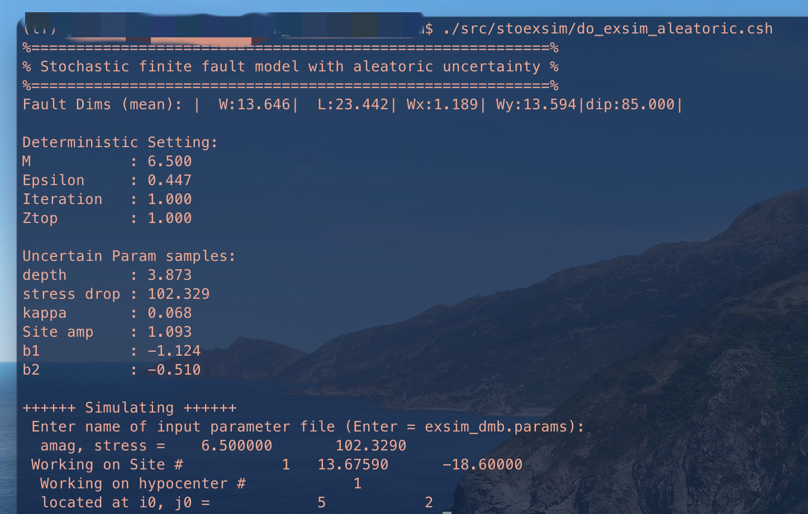
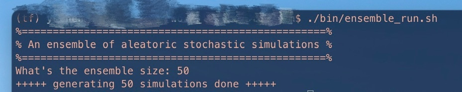

# stoexsim

Stochastic ground motion simulations with variability in model parameters.

## Introduction

A CLI interface for the implementation of the EXSIM (stochasict finite-fault model). Particularly, we provide extra capabilities in modeling some key parameters as random variables to account for variability.

> *Note: A concise introduction is shown below while a thorough Python implementation can be found in another [repo](https://github.com/leslieDLcy/eqstochsim).*

<details><summary>formulation of the Stochastic finite fault model</summary>
<p>

A stochastic representation that encapsulates the physics of the earthquake process and wave propagation plays the central role, from the seismological perspective, in characterizing the ground motions. One of the most desired advantage is that such type of representations explicitly distill the knowledge of various factors affecting ground motions (e.g. source, path, and site) into a parametric formulation.
In this study, we have adopted a well-validated stochastic seismological model, as given below, whereby source process, attenuation, and site effects are encapsulated in a parameterized form of the amplitude spectrum. A finite fault strategy is particularly employed to represent the geometry of larger ruptures for large earthquakes.

$$ A(f; \Theta) = E(f, M; \theta_{E}) \times P(f, R; \theta_{P}) \times S(f; \theta_{S}) $$

Particularly, the variability of such effects in the spectral formulation and hence the uncertainty in stochastic simulations are represented by probability distribution over the input parameters $\Theta=(\theta_{E}, \theta_{P}, \theta_{S})$.
</p>
</details>


## functionalities in short

- [x] A CLI interface facilitating the use of stochastic finite fault model;
- [x] Aleatoric uncertainty on the region-specific parameters

## how *stochastic* the simulations are ?

Though bearing the name "*the stochastic method*" for a while, Boore's model[^1] is not the only stochastic implementation in simulating ground motions of certainty earthquake scenarios. It should be, however, more appropritely referred to as *stochastic source method*[^2]. A standard implementation, shown below, will consider random slip distribution and hypocenter location, coupled with random phase in generating time series.  

```shell
$ "mechanism=N;depth=10;Mw=6.5;Repi=10; csh do_exsim.csh $mechanism $depth $Mw $Repi"
```

One step further, to reflect the aleatoric uncertainty of many region-specific parameters and then the variability of ground motions:


For practical convenience, you will probably want to generate a suite of simulations for a certain earthquake scenario. Input the number of simulations when prompted.



## References

```markdown
@article{chen2023physics,
  title={A physics-informed Bayesian framework for characterizing ground motion process in the presence of missing data},
  author={Chen, Yu and Patelli, Edoardo and Edwards, Benjamin and Beer, Michael},
  journal={Earthquake Engineering \& Structural Dynamics},
  publisher={Wiley Online Library}
}
```


[^1]: Atkinson etc. Stochastic Modeling of California Ground Motions
[^2]: Rezaeian etc. Simulation of synthetic ground motions for specified earthquake and site characteristics.


## License

`stoexsim` was created by Y. Chen. It is licensed under the terms of the MIT license.

<!-- TODO: Tweak the standart out look of the CLI -->
